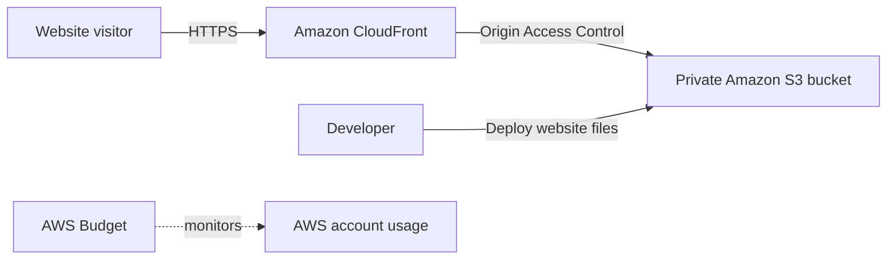

# CloudLaunch: AWS Cloud Portfolio

CloudLaunch is a beginner-friendly cloud project that deploys a personal
portfolio website using core Amazon Web Services. It demonstrates cloud
storage, content delivery, security, monitoring, versioning, and repeatable
deployment.

## Project goal

Build and publish a static portfolio website while keeping the Amazon S3 bucket
private and delivering the content securely over HTTPS through Amazon
CloudFront.

## Architecture



## AWS services

- **Amazon S3** stores the static website files.
- **S3 Versioning** protects against accidental overwrites or deletions.
- **Amazon CloudFront** provides HTTPS access and content delivery.
- **Origin Access Control (OAC)** allows CloudFront to read from the private
  bucket.
- **AWS Budgets** provides cost notifications.

## Planned repository structure

```text
aws-cloud-portfolio/
├── deploy/              # Repeatable deployment commands
├── docs/                # Architecture and setup documentation
├── screenshots/         # Evidence from the AWS Management Console
├── site/                # HTML, CSS and JavaScript website files
├── .gitignore
├── LICENSE
└── README.md
```

## Development roadmap

- [x] Define the project scope and architecture.
- [ ] Build the static portfolio website.
- [ ] Create a private S3 bucket and enable versioning.
- [ ] Create a CloudFront distribution with OAC.
- [ ] Add a repeatable deployment script.
- [ ] Test deployment, recovery and HTTPS access.
- [ ] Document the AWS resources with screenshots.
- [ ] Record and link the 5–10 minute YouTube demonstration.

## Security and cost rules

- Never commit AWS access keys, account IDs, secret keys or personal billing
  information.
- Keep the S3 bucket private.
- Use CloudFront OAC to grant only the required read access.
- Configure an AWS budget before deploying resources.
- Remove unnecessary resources after the assessment.

## Current status

The architecture and development plan are complete. Implementation is in
progress.
