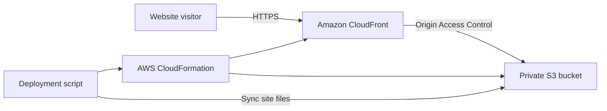

# CloudLaunch: AWS Cloud Portfolio

CloudLaunch is a beginner-friendly AWS project that deploys a static portfolio
website from a private Amazon S3 bucket through Amazon CloudFront. The
infrastructure is reproducible with CloudFormation and deployable through one
shell script.

## Architecture



## AWS concepts demonstrated

- **Amazon S3** stores the static HTML, CSS and JavaScript.
- **S3 encryption and versioning** protect stored website files.
- **S3 Block Public Access** prevents direct public bucket access.
- **Amazon CloudFront** provides the public HTTPS endpoint.
- **Origin Access Control** grants CloudFront read-only access to the bucket.
- **AWS CloudFormation** defines the infrastructure as code.
- **AWS CLI** makes deployment repeatable.
- **GitHub Actions** validates the template, site assets and deployment script.

An AWS Budget should be configured manually before deployment as a cost-safety
measure; it is not created by this template.

## Repository structure

```text
aws-cloud-portfolio/
├── .github/workflows/quality-checks.yml
├── deploy/deploy.sh
├── docs/
│   ├── architecture.md
│   ├── deployment.md
│   └── video-demo.md
├── infrastructure/cloudformation.yaml
├── screenshots/
├── site/
│   ├── index.html
│   ├── error.html
│   ├── styles.css
│   └── script.js
└── README.md
```

## Preview locally

Local preview does not require an AWS account:

```bash
git clone https://github.com/Lindani-cloud/aws-cloud-portfolio.git
cd aws-cloud-portfolio
python3 -m http.server 8000 --directory site
```

Open [http://localhost:8000](http://localhost:8000) and stop the server with
`Ctrl+C`.

## AWS prerequisites

1. Install AWS CLI v2.
2. Configure a non-root IAM identity with the required permissions.
3. Confirm authentication:

```bash
aws sts get-caller-identity
```

4. Configure an AWS Budget or billing alert.
5. Never commit credentials, account IDs or billing information.

## Deploy to AWS

```bash
chmod +x deploy/deploy.sh
AWS_REGION=af-south-1 ./deploy/deploy.sh
```

The script validates the template, creates or updates the CloudFormation stack,
reads the stack outputs, synchronizes `site/` to S3, invalidates CloudFront,
and prints the live HTTPS URL.

Use a custom stack name if needed:

```bash
STACK_NAME=cloudlaunch-demo \
AWS_REGION=af-south-1 \
./deploy/deploy.sh
```

CloudFront may take several minutes to finish provisioning or distribute a
fresh deployment.

## Automated checks

Every push and pull request triggers:

```text
cfn-lint infrastructure/cloudformation.yaml
bash -n deploy/deploy.sh
```

The workflow also confirms that all required website files exist and are not
empty.

## Documentation and demonstration

- [Architecture explanation](docs/architecture.md)
- [Deployment notes](docs/deployment.md)
- [YouTube demo walkthrough](docs/video-demo.md)

## Progress

- [x] Build the static portfolio website.
- [x] Define a private, encrypted and versioned S3 bucket.
- [x] Define CloudFront with Origin Access Control.
- [x] Add repeatable CloudFormation deployment.
- [x] Add automated infrastructure and site checks.
- [x] Document the architecture and demonstration flow.
- [ ] Deploy using valid AWS credentials.
- [ ] Capture AWS Console screenshots.
- [ ] Record and link the YouTube demonstration.
- [ ] Remove temporary AWS resources after assessment.

## Security and cost

The S3 bucket is not public. CloudFront is the only public website entry point.
Use an IAM identity with limited permissions, monitor billing, and delete
assessment resources when they are no longer required.

## Status

The website, infrastructure code, deployment automation and CI validation are
complete. Live AWS deployment and recording are the remaining evidence steps.
